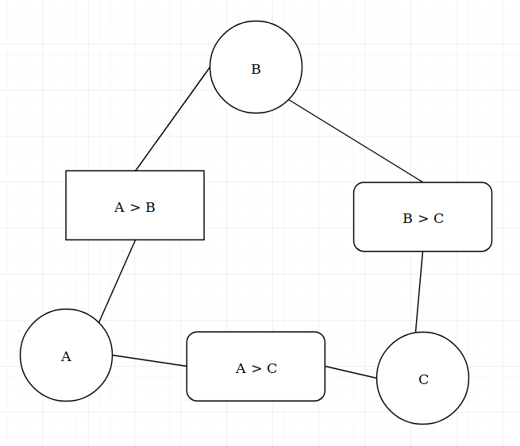

# Homework 1 -- Written Portion
#### Written By: Anthony Saieva (an2804)
---

### Part 1: Navigating Bugs

**1) State whether the environment is:**

 a) fully or partially observable,

 * The environment is fully observable because the problem states the map is known to all insects.

 b) deterministic or stochastic,
   * The environment is deterministic because the agent can always know the outcome of an action. Either a move to an adjacent square will succeed or it will not because another agent already occupies the square, either way the agent knows the outcome of each action.

 c) episodic or sequential
 * The environment is episodic since previous decisions don't effect the current decision.

 d) static or dynamic
* The environment is static since the environment does not change while the agent makes a decision.

 e) discrete or continuous
* The environment is discrete because there are specific time intervals and fixed locations.

 f) single- or multi-agent, assuming multiple insects may be present. Justify each of your answers with a simple, one-sentence explanation.
 * The environment is multi-agent because more than one agent can be present.


**2) Consider  the case of controlling a single insect moving toward a goal, an example of which is shown below.**

  a) What is a possible state space description for the problem?
* The state space description is the bug(agent) in every possible position on the board
  b) Indicate the size of the state space and a non trivial heuristic
* The size of the state space is all the possible positions on the board which is 17
* A possible heuristic is the Manhattan distance between the agent's position and the goal.

**3) Consider the case of controlling K insects toward K goals, an example of which is shown below.**

a) What is a posisible state space description for the problem?
* All possible permutations of K insects and K Goals placed on the board.

 b) What is the  size of the state space and a non trivial heuristic
* All permutations of the agent on the board is:

     ```
     (all possible positions for AgentK * all possible positions for agentK-1 * ...) = 17*16*...
     ```

     multiply this by 2 since you can also place K goals on the board.

* A non trivial heuristic would be the sum of the Manhattan distance for each agent to their respective goals

**4) Consider the case of controlling a single insect, but the maze now contains G spiders patrolling a known, periodic path. At a given time step t each guard g is at a position given by known functions.**

a) How do any of the environment properties change?
* Now the environment is dynamic since the position of the bugs changes over time.

b) What is a possible state space description?
* All possible locations of the agent, the guards, and the goal.

c) What is the size of the state space and a non-trivial heuristic
* All permutations of the agent and the two guards placed on the board. A non trivial heuristic
remains the Manhattan distance from the agent to the goal.


**5) Consider the case of controlling a single insect that can speed up as long as it doesn't change direction. After a move of v  squares in a direction, its available actions are to move up to v + 1  squares in the same direction, move 1 square in any of the other directions, or stay still. All squares that the insect passes over must be empty. The dots in the example below indicate the insect's stops at each step in the optimal plan.**

a) How does the environment change?

* Now sequential problem since your previous actions have an effect on your next best actions.

b) What is a possible description of the state space?

* The state space remains all possible locations of the bug on the board, but the action space has increased significantly

**6) Consider the case of controlling a single insect in a maze where certain squares are filled with pesticide, an example of which is shown below (pesticide squares are green). A valid solution navigating the insect toward its goal must not have it spending more than L  time steps in the pesticide squares, or else it will die.**

How do the environment properties change?

* Now the environment is continuous since previous actions will effect the next best action

What is a possible state space description of the problem?

* The location of the agent as well as how long the agent as been on poisonous squares.

Size of state space and heuristic
* The size of the state space is the number of positions on the board * L.
* A heuristic would be the Manhattan distance maybe plus how long you've been on poisonous squares at that the state


### Part 2: Comparing Search and Heuristics

**1) DFS List the order of states expanded and the overall path solution**

* States Expanded & Solution: A, B, D, G

**2) BFS List the order of states expanded and the overall path Solution**

* States Expanded & Solution: A, B, C, D, F

**3) Uniform Cost Search**

* States Expanded: A, B, C, D, F, G
* Solution: A, B, D, G

**4) Which heuristics are admissible?**

* h1, h2, and h3 are admissible. For each node the heuristic is less than or equal to the true cost

**5) Which heuristics are consistent?**
* h1, h2, and h4 are consistent. Difference in heuristic costs between adjacent nodes is less than the actual distance between them

**6) What orders will nodes be added to the fringe in A* search using h3**

* A, B, C, D, F, G
* Assuming use of closed set

**7) What order will the nodes be added to the closed set?**

* A, C, D, B, G

**8) Which path will A* return?**

* A --> C --> D --> G; total length 17

**9) With h(3) which path will greedy search return?**

* A --> C --> F; total length 26

### Part 3: Train CSP

**1) Write out  the CSP with variables A, B, C**

Domain: A,B,C --> {1,2,3}

* 0 < A, B, C < 4

Constraints to avoid collision:

* A > B
* A > C
* C > B

**2) Constraint Graph**



**3) Arc Consistency without variable assignment**

* A: 3
* B: 1,2
* C: 2

**4)Suppose we select A = 2 (train A departs at 2pm). What departure times are still possible for B and C after performing forward checking?**

* A: 2
* B: 1
* C: 1

**5) A = 2. Possible solutions after arc consistency?**

* A: 2
* B: X -- None
* C: X -- None
