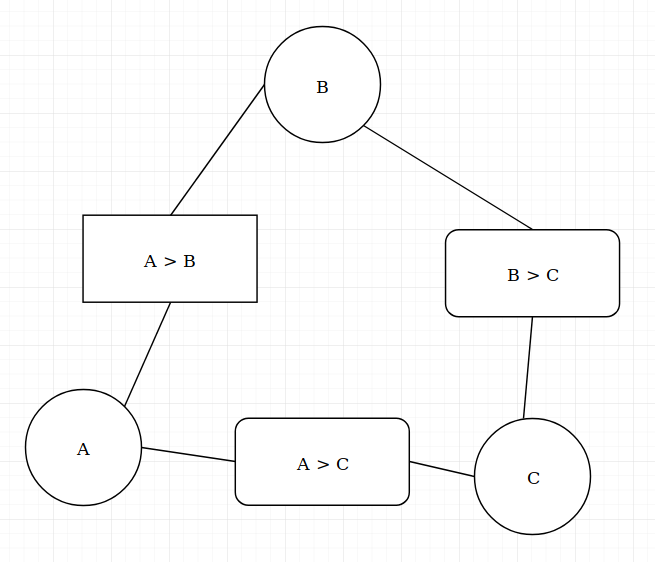

# Homework 1 -- Written Portion
#### Written By: Anthony Saieva (an2804)
---

### Part 1: Navigating Bugs

**1) State whether the environment is:**

 a) fully or partially observable,

 * The environment is fully observable because the problem states the map is known to all insects.

 b) deterministic or stochastic,
   * The environment is deterministic because the agent can always know the outcome of an action. Either a move to an adjacent square will succeed or it will not because another agent already occupies the square, either way the agent knows the outcome of each action.

 c) episodic or sequential
 * The environment is episodic since previous decisions don't effect the current decision.

 d) static or dynamic
* The environment is static since the environment does not change while the agent makes a decision.

 e) discrete or continuous
* The environment is discrete because there are specific time intervals and fixed locations.

 f) single- or multi-agent, assuming multiple insects may be present. Justify each of your answers with a simple, one-sentence explanation.
 * The environment is multi-agent because more than one agent can be present.


**2) Consider  the case of controlling a single insect moving toward a goal, an example of which is shown below.**

  a) What is a possible state space description for the problem?
* The state space description is the bug(agent) in every possible position on the board
  b) Indicate the size of the state space and a non trivial heuristic
* The size of the state space is all the possible positions on the board which is 17
* A possible heuristic is the Manhattan distance between the agent's position and the goal.

**3) Consider the case of controlling K insects toward K goals, an example of which is shown below.**

a) What is a posisible state space description for the problem?
* All possible permutations of K insects and K Goals placed on the board.

 b) What is the  size of the state space and a non trivial heuristic
* All permutations of the agent on the board is:

     ```
     (all possible positions for AgentK * all possible positions for agentK-1 * ...) = 17*16*...
     ```

     multiply this by 2 since you can also place K goals on the board.

* A non trivial heuristic would be the sum of the Manhattan distance for each agent to their respective goals

**4) Consider the case of controlling a single insect, but the maze now contains G spiders patrolling a known, periodic path. At a given time step t each guard g is at a position given by known functions.**

a) How do any of the environment properties change?
* Now the environment is dynamic since the position of the bugs changes over time.

b) What is a possible state space description?
* All possible locations of the agent, the guards, and the goal.

c) What is the size of the state space and a non-trivial heuristic
* All permutations of the agent and the two guards placed on the board. A non trivial heuristic
remains the Manhattan distance from the agent to the goal.


**5) Consider the case of controlling a single insect that can speed up as long as it doesn't change direction. After a move of v  squares in a direction, its available actions are to move up to v + 1  squares in the same direction, move 1 square in any of the other directions, or stay still. All squares that the insect passes over must be empty. The dots in the example below indicate the insect's stops at each step in the optimal plan.**

a) How does the environment change?

* Now sequential problem since your previous actions have an effect on your next best actions.

b) What is a possible description of the state space?

* The state space remains all possible locations of the bug on the board, but the action space has increased significantly

**6) Consider the case of controlling a single insect in a maze where certain squares are filled with pesticide, an example of which is shown below (pesticide squares are green). A valid solution navigating the insect toward its goal must not have it spending more than L  time steps in the pesticide squares, or else it will die.**

How do the environment properties change?

* Now the environment is continuous since previous actions will effect the next best action

What is a possible state space description of the problem?

* The location of the agent as well as how long the agent as been on poisonous squares.

Size of state space and heuristic
* The size of the state space is the number of positions on the board * L.
* A heuristic would be the Manhattan distance maybe plus how long you've been on poisonous squares at that the state


### Part 2: Comparing Search and Heuristics

**1) DFS List the order of states expanded and the overall path solution**

* States Expanded & Solution: A, B, D, G

**2) BFS List the order of states expanded and the overall path Solution**

* States Expanded & Solution: A, B, C, D, F

**3) Uniform Cost Search**

* States Expanded: A, B, C, D, F, G
* Solution: A, B, D, G

**4) Which heuristics are admissible?**

* h1, h2, and h3 are admissible. For each node the heuristic is less than or equal to the true cost

**5) Which heuristics are consistent?**
* h1, h2, and h4 are consistent. Difference in heuristic costs between adjacent nodes is less than the actual distance between them

**6) What orders will nodes be added to the fringe in A* search using h3**

* A, B, C, D, F, G
* Assuming use of closed set

**7) What order will the nodes be added to the closed set?**

* A, C, D, B, G

**8) Which path will A* return?**

* A --> C --> D --> G; total length 17

**9) With h(3) which path will greedy search return?**

* A --> C --> F; total length 26

### Part 3: Train CSP

**1) Write out  the CSP with variables A, B, C**

Domain: A,B,C --> {1,2,3}

* 0 < A, B, C < 4

Constraints to avoid collision:

* A > B
* A > C
* C > B

**2) Constraint Graph**



**3) Arc Consistency without variable assignment**

* A: 3
* B: 1,2
* C: 2

**4)Suppose we select A = 2 (train A departs at 2pm). What departure times are still possible for B and C after performing forward checking?**

* A: 2
* B: 1
* C: 1

**5) A = 2. Possible solutions after arc consistency?**

* A: 2
* B: X -- None
* C: X -- None


## Code Submission

```
"""
COMS W4701 Artificial Intelligence - Programming Homework 1

In this assignment you will implement and compare different search strategies
for solving the n-Puzzle, which is a generalization of the 8 and 15 puzzle to
squares of arbitrary size (we will only test it with 8-puzzles for now).
See Courseworks for detailed instructions.

@author: Anthony Saieva (Narin) an2804
"""

import time

def state_to_string(state):
    row_strings = [" ".join([str(cell) for cell in row]) for row in state]
    return "\n".join(row_strings)


def swap_cells(state, i1, j1, i2, j2):
    """
    Returns a new state with the cells (i1,j1) and (i2,j2) swapped.
    """
    value1 = state[i1][j1]
    value2 = state[i2][j2]

    new_state = []
    for row in range(len(state)):
        new_row = []
        for column in range(len(state[row])):
            if row == i1 and column == j1:
                new_row.append(value2)
            elif row == i2 and column == j2:
                new_row.append(value1)
            else:
                new_row.append(state[row][column])
        new_state.append(tuple(new_row))
    return tuple(new_state)

def get_successors(state):
    """
    This function returns a list of possible successor states resulting
    from applicable actions.
    The result should be a list containing (Action, state) tuples.
    For example [("Up", ((1, 4, 2),(0, 5, 8),(3, 6, 7))),
                 ("Left",((4, 0, 2),(1, 5, 8),(3, 6, 7)))]
    """

    holeX = -1
    holeY = -1
    ACTIONS = ["Left", "Right","Up", "Down"]
    found = False
    for x in range(0,3):
        for y in range(0,3):
            if state[x][y] == 0:
                found = True
                holeX = x
                holeY = y
                break
        if found:
            break
    assert(holeX != -1)
    assert(holeY != -1)
    child_states = []

    # YOUR CODE HERE . Hint: Find the "hole" first, then generate each possible
    # successor state by calling the swap_cells method.
    # Exclude actions that are not applicable.

    if(holeY < 2):
        child_states.append((ACTIONS[0], swap_cells(state, holeX, holeY, holeX, holeY+1)))
    if(holeY > 0):
        child_states.append((ACTIONS[1], swap_cells(state, holeX, holeY, holeX, holeY-1)))
    if(holeX < 2):
        child_states.append((ACTIONS[2], swap_cells(state, holeX, holeY, holeX+1, holeY)))
    if(holeX > 0):
        child_states.append((ACTIONS[3], swap_cells(state, holeX, holeY, holeX-1, holeY)))


    return child_states


def goal_test(state):
    """
    Returns True if the state is a goal state, False otherwise.
    """

    goal_state = ((0,1,2),(3,4,5),(6,7,8))
    if goal_state == state:
        return True
    return False

def get_solution(mapping, state):
    """
    returns a list of actions ["RIGHT", "UP", ...]
    that are the solution based on the given mapping
    """
    actions = []
    search_state = state
    while(mapping[search_state] != 'initial_state'):
        actions.append(mapping[search_state][0])
        search_state = mapping[search_state][1]
    actions.reverse()
    return actions

def bfs(state):
    """
    Breadth first search.
    Returns three values: A list of actions, the number of states expanded, and
    the maximum size of the fringe.
    You may want to keep track of three mutable data structures:
    - The fringe of nodes to expand (operating as a queue in BFS)
    - A set of closed nodes already expanded
    - A mapping (dictionary) from a given node to its parent and associated action
    """
    states_expanded = 0
    max_fringe = 0

    fringe = []
    closed = set()
    closed_list = []
    backtrack = {}

    #YOUR CODE HERE
    queue = []
    if len(queue) == 0:
        backtrack[state] = "initial_state"
        queue.append(state)

    while(len(queue) != 0):
        parent_state = queue.pop(0)

        if goal_test(parent_state):
            # need to return stuff here
            print("You found the goal")
            solution = get_solution(backtrack, parent_state)
            states_expanded = len(closed)
            # add one for the goal state that we found
            states_expanded += 1
            return solution, states_expanded, max_fringe

        successors = get_successors(parent_state)
        closed.add(parent_state)

        for node in successors:
            action = node[0]
            child_state = node[1]

            # Don't re add already closed nodes to the tree
            if child_state in closed:
                continue

            # update the mapping structure
            backtrack[child_state] = (action, parent_state)

            queue.append(child_state)
            if(len(queue) > max_fringe):
                max_fringe = len(queue)

    #  return solution, states_expanded, max_fringe
    return None, states_expanded, max_fringe # No solution found


def dfs(state):
    """
    Depth first search.
    Returns three values: A list of actions, the number of states expanded, and
    the maximum size of the fringe.
    You may want to keep track of three mutable data structures:
    - The fringe of nodes to expand (operating as a stack in DFS)
    - A set of closed nodes already expanded
    - A mapping (dictionary) from a given node to its parent and associated action
    """
    states_expanded = 0
    max_fringe = 0

    fringe = []
    closed = set()
    parents = {}
    #YOUR CODE HERE

    queue = []
    if len(queue) == 0:
        parents[state] = "initial_state"
        queue.append(state)

    while(len(queue) != 0):
        parent_state = queue.pop()

        if goal_test(parent_state):
            # need to return stuff here
            print("You found the goal")
            solution = get_solution(parents, parent_state)
            states_expanded = len(closed)
            # add one for the goal state that we found
            states_expanded += 1
            return solution, states_expanded, max_fringe

        successors = get_successors(parent_state)

        closed.add(parent_state)

        for node in successors:
            action = node[0]
            child_state = node[1]

            # Don't re add already closed nodes to the tree
            if child_state in closed:
                continue

            # update the mapping structure
            parents[child_state] = (action, parent_state)

            queue.append(child_state)
            if(len(queue) > max_fringe):
                max_fringe = len(queue)

    #  return solution, states_expanded, max_fringe
    return None, states_expanded, max_fringe # No solution found


def misplaced_heuristic(state):
    """
    Returns the number of misplaced tiles.
    """

    #YOUR CODE HERE
    count = 0
    goal_state = ((0,1,2),(3,4,5),(6,7,8))
    for x in range(0,3):
        for y in range(0,3):
            if state[x][y] != goal_state[x][y]:
                count += 1
    return count


def manhattan_heuristic(state):
    """
    For each misplaced tile, compute the Manhattan distance between the current
    position and the goal position. Then return the sum of all distances.
    """
    goal_placings = {
                     0:(0,0),
                     1:(0,1),
                     2:(0,2),
                     3:(1,0),
                     4:(1,1),
                     5:(1,2),
                     6:(2,0),
                     7:(2,1),
                     8:(2,2)
                     }
    total = 0
    for x in range(0,3):
        for y in range(0,3):
            num = state[x][y]
            diffX = abs(goal_placings[num][0]-x)
            diffY = abs(goal_placings[num][1]-y)
            total += diffX
            total += diffY

    return total


def best_first(state, heuristic):
    """
    Best first search.
    Returns three values: A list of actions, the number of states expanded, and
    the maximum size of the fringe.
    You may want to keep track of three mutable data structures:
    - The fringe of nodes to expand (operating as a priority queue in greedy search)
    - A set of closed nodes already expanded
    - A mapping (dictionary) from a given node to its parent and associated action
    """
    # You may want to use these functions to maintain a priority queue
    from heapq import heappush
    from heapq import heappop

    states_expanded = 0
    max_fringe = 0

    fringe = []
    closed = set()
    parents = {}

    #YOUR CODE HERE
    if not fringe:
        parents[state] = "initial_state"
        pair = (heuristic(state), state)
        heappush(fringe, pair)

    while fringe:
        parent_pair = heappop(fringe)
        parent_state = parent_pair[1]

        if goal_test(parent_state):
            solved = get_solution(parents, parent_state)
            states_expanded = len(closed)
            # add one for goal state
            states_expanded += 1
            return solved, states_expanded, max_fringe

        successors = get_successors(parent_state)
        closed.add(parent_state)

        for node in successors:
            action = node[0]
            child_state = node[1]

            pair = (heuristic(child_state), child_state)

            # Don't re add already closed nodes to the tree
            if child_state in closed:
                continue

            parents[child_state] = (action, parent_state)

            heappush(fringe, pair)

            if len(fringe) > max_fringe:
                max_fringe = len(fringe)

    return None, states_expanded, max_fringe # No solution found


def astar(state, heuristic):
    """
    A-star search.
    Returns three values: A list of actions, the number of states expanded, and
    the maximum size of the fringe.
    You may want to keep track of three mutable data structures:
    - The fringe of nodes to expand (operating as a priority queue in greedy search)
    - A set of closed nodes already expanded
    - A mapping (dictionary) from a given node to its parent and associated action
    """
    # You may want to use these functions to maintain a priority queue
    from heapq import heappush
    from heapq import heappop

    states_expanded = 0
    max_fringe = 0

    fringe = []
    closed = set()
    parents = {}
    costs = {}

    #YOUR CODE HERE
    if not fringe:
        parents[state] = "initial_state"
        costs[state] = 0
        pair = (heuristic(state), state)
        heappush(fringe, pair)

    while fringe:
        parent_pair = heappop(fringe)
        parent_state = parent_pair[1]

        if goal_test(parent_state):
            solved = get_solution(parents, parent_state)
            states_expanded = len(closed)
            # add one for goal state
            states_expanded += 1
            return solved, states_expanded, max_fringe

        successors = get_successors(parent_state)
        closed.add(parent_state)

        for node in successors:
            action = node[0]
            child_state = node[1]

            # Don't re add already closed nodes to the tree
            if child_state in closed:
                continue

            cost = costs[parent_state] + 1
            pair = (cost + heuristic(child_state),
                    child_state)


            costs[child_state] = cost
            parents[child_state] = (action, parent_state)

            heappush(fringe, pair)

            if len(fringe) > max_fringe:
                max_fringe = len(fringe)


    return None, states_expanded, max_fringe # No solution found


def print_result(solution, states_expanded, max_fringe):
    """
    Helper function to format test output.
    """
    if solution is None:
        print("No solution found.")
    else:
        print("Solution has {} actions.".format(len(solution)))
    print("Total states expanded: {}.".format(states_expanded))
    print("Max fringe size: {}.".format(max_fringe))


if __name__ == "__main__":

    #Easy test case
    # test_state = ((1, 4, 2),
    #               (0, 5, 8),
    #               (3, 6, 7))

    # More difficult test case
    test_state = ((7, 2, 4),
                 (5, 0, 6),
                 (8, 3, 1))

    print(state_to_string(test_state))
    print()

    print("====BFS====")
    start = time.time()
    solution, states_expanded, max_fringe = bfs(test_state) #
    end = time.time()
    print_result(solution, states_expanded, max_fringe)
    if solution is not None:
        print(solution)
    print("Total time: {0:.3f}s".format(end-start))

    # print()
    print("====DFS====")
    start = time.time()
    solution, states_expanded, max_fringe = dfs(test_state)
    end = time.time()
    print_result(solution, states_expanded, max_fringe)
    print("Total time: {0:.3f}s".format(end-start))

    print()
    print("====Greedy Best-First (Misplaced Tiles Heuristic)====")
    start = time.time()
    solution, states_expanded, max_fringe = best_first(test_state, misplaced_heuristic)
    end = time.time()
    print_result(solution, states_expanded, max_fringe)
    print("Total time: {0:.3f}s".format(end-start))

    print()
    print("====A* (Misplaced Tiles Heuristic)====")
    start = time.time()
    solution, states_expanded, max_fringe = astar(test_state, misplaced_heuristic)
    end = time.time()
    print_result(solution, states_expanded, max_fringe)
    print("Total time: {0:.3f}s".format(end-start))

    print()
    print("====A* (Total Manhattan Distance Heuristic)====")
    start = time.time()
    solution, states_expanded, max_fringe = astar(test_state, manhattan_heuristic)
    end = time.time()
    print_result(solution, states_expanded, max_fringe)
    print("Total time: {0:.3f}s".format(end-start))

```
