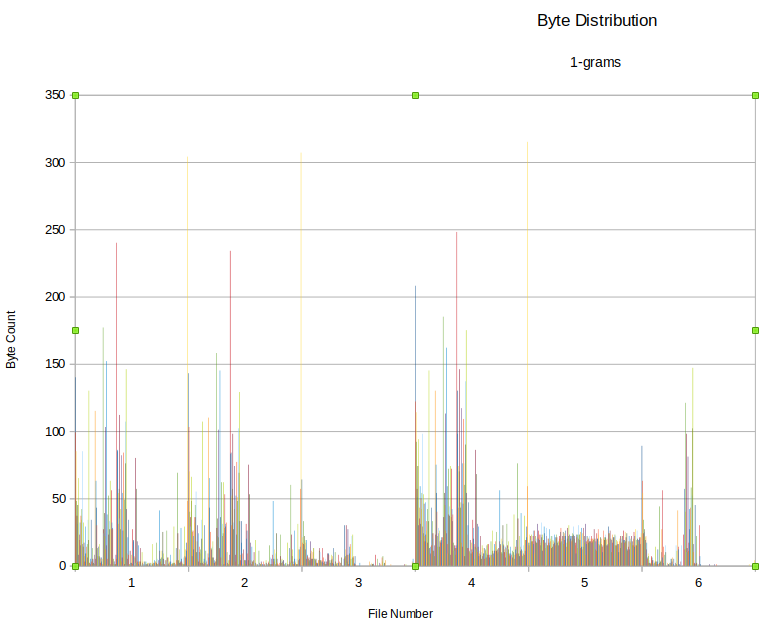

# Homework 3 Report
---
### Damballa RN DGA's Case Study Summary
The case study covers Malware that use Domain Generation algorithms to bypass domain blacklists. Attackers change the domains associated with the command and control servers so that AV can't block the requests. The particular malware that was uncovered in this case study was a Zeus v3 variant that used Peer to Peer as its primary command-and-control mechanism but used DGA domains if it failed.


After clustering they tagged the clusters as either *Known Malicious* or *Unknown*. DGA's generate thousands of domains per week so tackling the problem at this scale is untenable by human users. Using machines to deal with this problem lets Damballa group many domain names quickly.

After clustering, to track the original C&C server Damballa associated the many domain names with only a few ip addresses. An email address is associated with all domain names when the domain names are registered so they looked up the associated email address and found a few domains associated with the same email address. They also found previously unidentified domains associated with the same email. Once the questionable sites were tracked down it was easy to get a copy of the malware for analysis. They found that the malware generated the seemingly random domains using the date as a seed for the DGA. By running the malware in an environment that made it seem like the day was the same as the day the questionable requests were made Damballa verified that the suspicious domains identified by the clustering algorithm were in fact associated with the malware in question. Checking the malicious distribution domains Damballa found this malware was spread via Better Business Bureau and NACHA spamming campaigns.

The malware was an executable meant for a Windows 7 64 bit environment, and was downloaded into ...\AppData\Roaming. By putting it in this folder it meant that on an enterprise system this executable would remain available regardless of the machine every time the user logged in. The malware also created firewall rules, and autostart registry entries so that the malware could function correctly. The firewall rules allow the malware to access the command and control servers, and the autostart entry starts the malware automatically after a system restart. To avoid AV the malware is polymorphic, meaning that the actual contents vary but the function remains the same. AV often blacklists malware based on a hash of the file contents. Because no two copies of the malware are the same AV software would have difficulty detecting the malware this way. The intent of the malware is to steal banking information and then exfiltrate that info via encrypted HTTP POST requests. The first attempt to connect to the botnet and the criminal operator is to use P2P connections. If none are available it resorts to  domain generation.

In summary, Damballa began tracking down the malware by monitoriing nonexistent domain name responses (NXDomains). Previous studies have shown a high number of NXDomain responses are associated with domain fluxing. After a list of fake domains was compiled they were clustered using K-Means algorithms into and mapped back to the registered domains used by the attackers. Damballa continued to work backwards to find exploit sites, redirector domains, and the original spam messages.


### Symantec 2019 1Q threat report
* Overall ransomware was down 20%
* Mobile ransomware was up 33%
* Malicious powershell scripts were up 100%
* The most common purpose of targeted attacks is intelligence gathering and the most common method is spear phishing
* Connected cameras were the other most attacked IoT device aside from routers

### Describe the process of performing dynamic analysis on malware
The difficulty with performing dynamic analysis on malware is that the environment needs to be controlled and contained so the malware can't cause any damage but still needs to seem real so that the malware can't detect that it is being studied. Therefore it needs to have internet access and the ability to contact external sites. Running the malware in a VM may not be sufficient because the malware may detect it is in a VM and shut down. Of course some malware needs to run in a VM to attack cloud computing, but this is unknown before running the program. AV software can't be present because malware may attempt to detect AV software and act differently. Malware is usually targeted at a specific OS so one must test each OS to see which OS the malware is targeting. The malware also may rely on certain exploits in various libraries and system level programs so assuming this malware was taken from an actual environment the test environment must replicate the real environment as closely as possible. Any dependencies must be the same version and patch level. Some malware requires specific hardware so the test environment must use the same hardware as well. Furthermore because the malware environment may need  to cleaned every time if the malware irreparably damages the environment in some way the study environment must be easy to reset. For VM's this is simply done by resetting to a clean snapshot. For malware that must be tested on a real machine the person studying the malware must either reimage the OS or for smaller changes revert modified files to the clean version.

Some malware is meant to infect any machine it comes across while others are meant to attack specific machines. For malware that is highly specific the analysis environment must be the same as the target. For more general malware it is good to have a standard environment common to many computers to best replicate the most common attack scenario.

If you are protecting a certain environment the test environment must be the same as the environment you are protecting. Any discrepencies may lead to an unaddresses threat (i.e. different machine, different versions of system libs/compilers etc.)


### How do botnets use DNS to their advantage
One way to try and shut down a bot net is to ban the IPs that are used as Command and Control centers. To combat this, malware takes advantage of DNS to circumvent the IP bans. Multiple IP addresses are mapped to the same domain name so the malware can refer to the command and control center via hostname and let DNS circumvent the IP ban. The registry doesn't remove the domain name because bot owners will just register a new one and the registry operators will do so to remain in business. This form of circumvention is called IP fluxing.

One form of IP fluxing is single flux. In this flavor of fluxing the malicious actor registers hundreds or thousands of IP addresses with the same hostname and the IP addresses are registered and deregistered repeatedly. This is implemented using round robin allocation and short time to live values.

The second form of IP fluxing is called double fluxing. This not only fluxes the IP addresses associated with the domain names but also fluxes the IP addresses of the DNS servers that perform the domain name lookups.

Another method used by botnets to circumvent controls is domain fluxing. Domain fluxing is the inverse of IP fluxing. Many different domain names are registered to the same IP address. The domain fluxing abuses the DNS property that many domains can be registered to the same IP addresses. For instance the registration for \*.damballa.com covers both adnthinog.damballa.com and zzzzzzzzz.damballa.com. By having each compromised machine access a unique domain name the botnet operator can identify a victim, track success with different delivery techniques, and bypass anti spam filters.

The second flavor of domain fluxing is called Domain generation algorithms. This is used to prevent investigation and to make it hard to blacklist domains. In this technique the malware generates a new set of domain names every day and attempts to contact C&C infrastructure at these seemingly random domains. Typically these are only used for a single day so the high turnover makes it very hard to track and prevent this sort of communication.

In conclusion botnets abuse DNS to find the command and control infrastructure by fluxing the DNS records in different ways provides varying degrees of resilience to shutdown.


## Static Analysis Question

### General Similarity Notes
* file1 and file4 have very similar fuzzy hashes. And match with a score of 79
* file1, file2, file4 can be compiled from any source language that interfaces with gcc but usually come from C/C++
* File 3 is a compiled java file
* File 6 is a python executable
* The strings from file 4 are the same as the strings from file 1 concatenated with strings from file 3
* Files 1 2 and 4 are linked with the same dynamic libraries
* They depend on the following
```
linux-vdso.so.1 (0x00007ffe2f9e6000)
	libcrypto.so.1.0.0 => /usr/lib/x86_64-linux-gnu/libcrypto.so.1.0.0 (0x00007f4a9da43000)
	libc.so.6 => /lib/x86_64-linux-gnu/libc.so.6 (0x00007f4a9d652000)
	libdl.so.2 => /lib/x86_64-linux-gnu/libdl.so.2 (0x00007f4a9d44e000)
	/lib64/ld-linux-x86-64.so.2 (0x00007f4a9de86000)
```
* A closer look at the disassembly for files 1 and 2 shows that they use the same function names and functions `_Z7decryptPhiS_iS_S_` and `_Z12handleErrorsv`
* File 4 has the same function names as well.
* Files 1 2 and 4 all call the above functions from main and then library functions there after.
* The name mangling above suggests C++ code and not C code.
* The main methods for file1 and file2 are very similar but file2 has some control flow code at the beginning of main that make it look slightly different.
* word count values
```
word line byte filename
19   207 14256 file1
25   181 14096 file2
17    52  1409 file3
43   305 17665 file4
18   116  5000 file5
22    74  3025 file6
144   935 55451 total
```
#### Byte Distributions

* Doesn't include null bytes due to scaling problems, and colors are the same for each byte value across files. So there are 255 columns per file.  
* It's pretty clear from the byte distributions that files 1 2 and 4 are closely related even if file4 is larger than the other two.
* File 5 has a uniform byte distribution

### File 1
* Fuzzy Hash: 192:GJbXCoWzruCJ9qOIfxivTzkIv67XpMla40y5c9Si:qX5CJKxORva,"file1"
* General File Info
```
file1: ELF 64-bit LSB executable, x86-64, version 1 (SYSV), dynamically linked, interpreter /lib64/l, for GNU/Linux 2.6.32, BuildID[sha1]=c47c3f61d0efce4eaea4dd521d45953d69044903, not stripped
```
* Compiled for AMD machines
* Contains references to OpenSSL and has prints statements for encrypted and unencrypted text
* Contains string "The quick brown fox"... which is commonly used as filler
* Seems to do some sort of encryption/decryption using openssl and then print the lengths, plaintext, and ciphertext.

### File 2
* Fuzzy Hash: 192:Glg9oWzTMiTerld9dB7rs7sHW4BuKP4TLW05cxSi:xRMiTe/B7As22dPo,"file2"
* General File Info
```
file2: ELF 64-bit LSB executable, x86-64, version 1 (SYSV), dynamically linked, interpreter /lib64/l, for GNU/Linux 2.6.32, BuildID[sha1]=06497d71f208d26bb6bc202fd7432da199d1bffc, not stripped
```
* Compiled for AMD machines
* Similar to File1 in dependencies and strings but doesn't contain the print statements/filler that file1 does.
* Seems similar in functionality to file1 but doesn't do the printing

### File 3
* Fuzzy Hash: 24:2EJsrSUdYyQulIidTyGgCdSFSvHJsSZ19yciSKX5Wao+cXwv0SIlg/a:2EJHdyFlvdTyGUFSvHeSZurSe5TotwM3,"file3"

* General File Info
```
file3: compiled Java class data, version 52.0 (Java 1.8)
```
* depends on standard string and object java classes and nothing more. Name of the class seems to be RecursionExampleDirectory
* The included java libraries suggest some sort of filesystem traversal/manipulation.
* The references to Java print functions suggest that it prints something as well


### File 4
* Fuzzy Hash: 192:GJbXCoWzruCJ9qOIfxivTzkIv67XpMla40y5c9SiRERKlhqILk9DucYsszi35O2:qX5CJKxORvadFvLkYSszipr,"file4"
* General File Info
```
file4: ELF 64-bit LSB executable, x86-64, version 1 (SYSV), dynamically linked, interpreter /lib64/l, for GNU/Linux 2.6.32, BuildID[sha1]=c47c3f61d0efce4eaea4dd521d45953d69044903, not stripped
```
* Compiled for AMD machines
* File4 strings are almost the same as all the strings from file3 appended to all the strings from file 1.
* This is odd as ELF files usually don't contain references to Java parent classes.
Objdump shows a main and control flow similar in functionality to files 1 and 2.
* It is unclear if the Java strings involved serve any purpose as the code section doesn't contain any references to them.

### File 5
* There is a uniform byte distribution which suggests this is an encrypted file or random bytes.
* Fuzzy Hash: 96:S27REn2YBH9jCKBUCckw7B2nayqV7dM4rcydaMEtfQ:S27RE2C4UZJIB2ndqHPrzw9tY,"file5"
* General File Info
```
file5: data
```
<<<<<<< HEAD
* This is not a zip file or a tarball
* The exact lenvth of 5000 bytes suggests this might be random data rather than encrypted, but it could also be some sort of padding.
=======
* exactly 5000 bytes suggests padding or the file was cut short
>>>>>>> 9541ca8d11bd1ccec537c596855f3d94c29bbaa6

### File 6
* Fuzzy Hash: 48:OaHwyJF+EQfW8pYhBBe7OvkF4B9Be4B4BSVBMHs0KDPETLeaNrGXj02GYdsSBMK9:c3K8qFBbha9rgWZcPnKO,"file6"
* General File Info
```
file6: python 2.7 byte-compiled
```
* strings reveals depedency on the scapy library seems to do things with a UDP packet and the different fields of UDP packets.
* references to the time stamp both in field names and in print statements
* References the scapy time stamp protocol module suggest in conjuction with the above information suggests this file does something with UDP timestamps.
