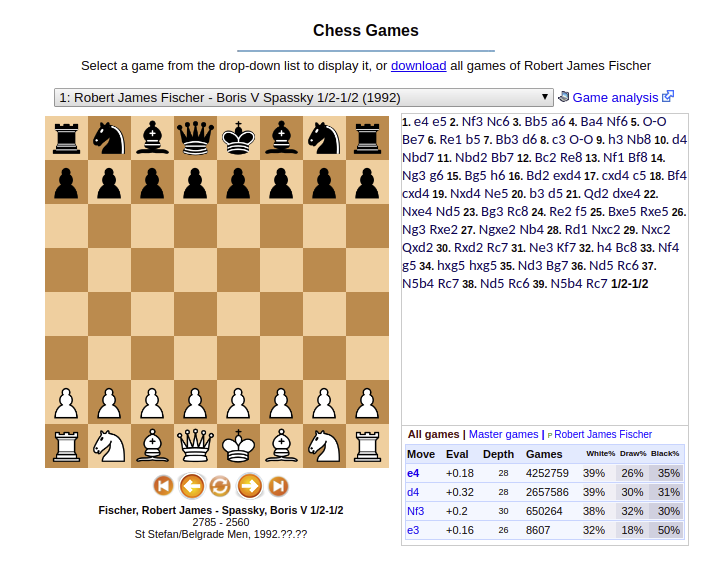
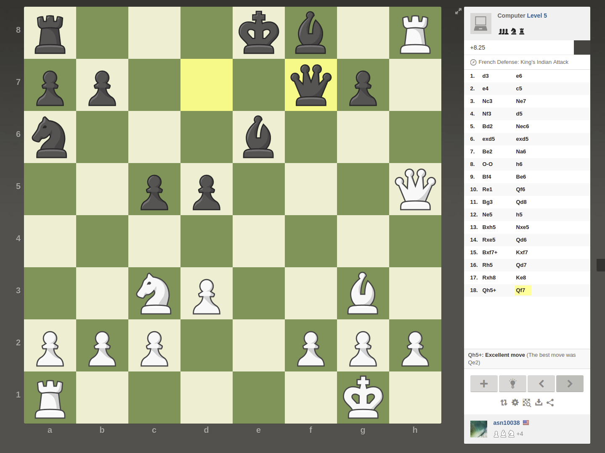
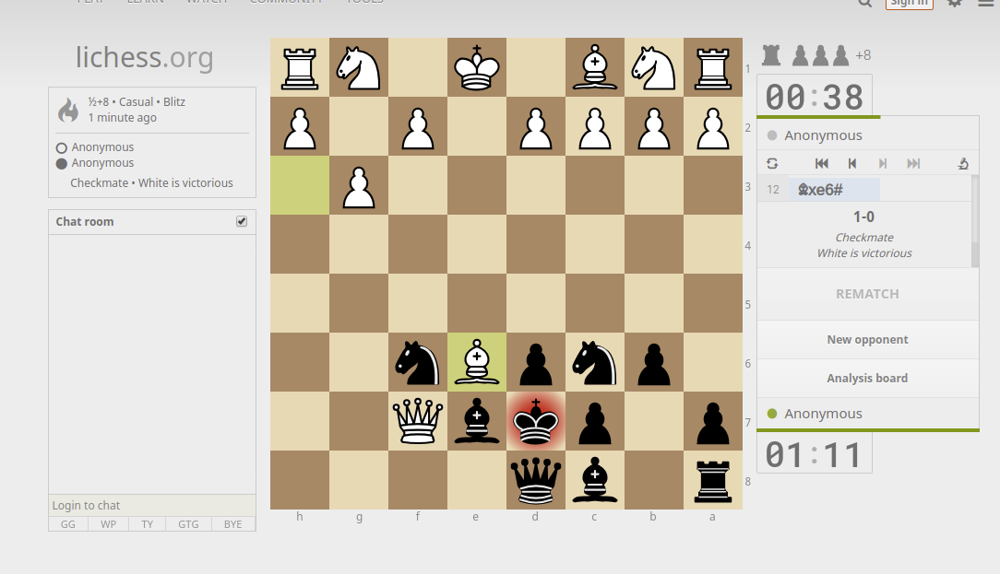

# Homework 11 Write Up
---
## 1) Restate the two ideas that you are deciding between

### Bet Tracker
* Benefit someone who is gambling for one night on baseball at Westgate sportsbook
* They will interact with images of the team logos/text that indicate the bets they are making
* The interaction is to add and remove bets from a list of active and past bets
* They will be able to bet with a strategy and stay within the confines of a betting strategy
* The site will show a graph/chart that shows if they are within the limitations of the designed betting strategy

### Chess Explorer
* Benefit someone who is trying to study specific positions on a chess board and learn the best moves
* They will interact with a chess board
* They will interact with it by dragging the pieces
* The goal is to learn the best possible future state given a certain position
* They will know if they've made the correct move as the site will show how the odds of winning have changed

## 2) For both of these ideas find 3 applications that solve a similar problem or part of the problem

### Related Content: Bet Tracker
#### social.fans.unite.com/bet-tracker
* This site is a bet tracker for all bets made by a particular user. It contains sophisticated graphs and charts that show the users progress. It is related to my idea in that the UI displays the same information however it is not limited in scope and all bets must be added custom.
* 
* The table is clear and contains all the columns that I would need to display. One challenge in this project is picking what information to display they have chosen a certain subset of fields. I think it would make sense for me to choose the same/similar subset of fields.
* The chart shows progress over a long period of time. This product only tracks things for a night but the progress over time idea remains the same. The chart also provides some nice insights into the activity.

#### Westgate Online Sportsbook
* This site shows the available bets for the given night
* 
* One challenge when displaying available bets is showing the right information. The site shows all the information required before making a bet but doesn't do so in an easy to read way. I can show the same information to convey to the user which bet is which.
* Clicking on the bar graph icon shows current betting activity. I think this much information is probably out of scope, but having a popup next to the available bet with related information is a nice touch.

#### Bet Tracking Excel Template
* This is an excel template designed for sports betting
* 
* The bet tracker contains the common formulas and metrics that are used to measure success/failure. I think I will need a lot of these same formulas to show relevant information. Most are obvious but some are a bit trickier
* The excel sheet highlights certain fields that are alarming. This is an easy way to show the user which bets they may want to change and which bets they may want to change to reduce risk.

### Related Content: Chess Explorer

#### Chess DB
* This is a DB that holds thousands of games from grandmasters and normal players and also offers an interface to see what the best moves were and how well the players performed.
* 
* The site has all the data of past games that are available for study. It's also easy to download the files containing all the info for these games so I can use them. I am going to include some past games as examples for how the positions have played out in different past games with real players
* The site also has a nice search feature that lets the users search through all the available games. I don't really play chess seriously and I don't know what information is relevant when searching a game. The database includes the tournament, the winner, the players, and the opening code which seems to be the way to classify the game.
#### Chess.com
* This is a site that offers many services including playing other people online.
* 
* They made the display of the board really large and the primary thing on the screen. It makes the game very easy to see and understand. Other sites include a chess board but because the primary purpose isn't to play the game the small board can be hard to see
* The site also includes a small bar that shows the score of the game. It is small enough that it doesn't take up too much space on the screen but large enough that it clearly shows who is winning the game and by how much. They also color the bar with respect to the win probability so if white has a 70% chance of winning then 70% of the bar is white. I think this is a clear way of showing the score. I would like to use something similar.

### LiChess
* This site is a competitor to chess.com and offers many of the same services with less advanced display
* 
* I don't like the display it is small and looks clunky but they use some light highlighting around the pieces that move to show what is happening, and the colors change in the event of check/checkmate moves. The color is small and non obtrusive I think this is a good thing to have in the site to make the siginificance of the moves clearer.
* The site has some graphs that show how the odds of winning and losing the game of are changing.

## Media
### Bet Tracker
* I chose to include the images of the baseball team logos. The bettors will drag and drop these images to activate bets and influence the statistics. I chose to include these instead of the charts/logos because this would be a twist on the traditional bet tracking apps. None of the existing apps have the bets already available, you have to make them yourself. Dragging and dropping would make this system much easier to use.

### Chess Explorer
* I included all of the games played by Bobby Fischer that are publicly available on the ChessDB. I chose these instead of the chess piece images since the chess pieces are really just used to demonstrate the information in the database collection. Also the positions are the heart of what the users are trying to study.
