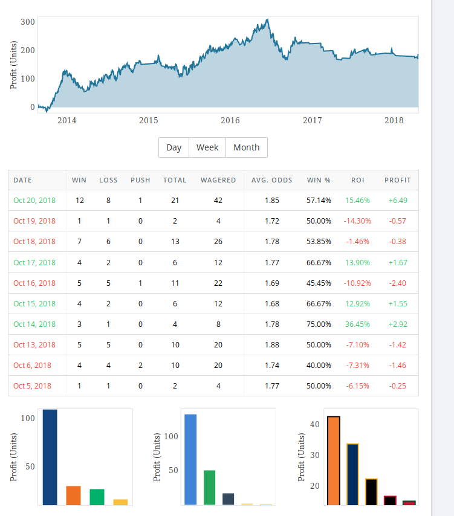
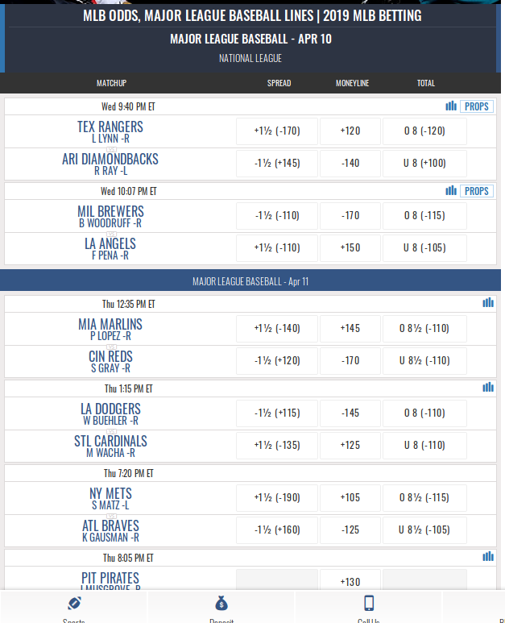
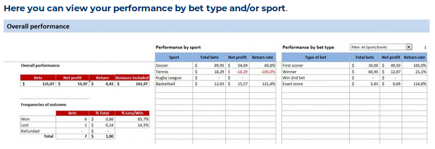

# Homework 11 Write Up
---
## 1) Restate the two ideas that you are deciding between

### Bet Tracker
* Benefit someone who is gambling for one night at Westgate sportsbook
* They will interact with images of the team logos/text that indicate the bets they are making
* The interaction is to add and remove bets from a list of active and past bets
* They will be able to bet with a strategy and stay within the confines of a betting strategy
* The site will show a graph/chart that shows if they are within the limitations of the designed betting strategy

### Chess Explorer
* Benefit someone who is trying to memorize common chess openings
* They will interact with a chess board
* They will interact with it by dragging the pieces
* The goal is to learn the best possible future state given a certain position
* They will know if they've made the correct move as the site will show how the odds of winning have changed

## 2) For both of these ideas find 3 applications that solve a similar problem or part of the problem

### Bet Tracker
#### social.fans.unite.com/bet-tracker
* This site is a bet tracker for all bets made by a particular user. It contains sophisticated graphs and charts that show the users progress. It is related to my idea in that the UI displays the same information however it is not limited in scope and all bets must be added custom.
* 
* The table is clear and contains all the columns that I would need to display. One challenge in this project is picking what information to display they have chosen a certain subset of fields. I think it would make sense for me to choose the same/similar subset of fields.
* The chart shows progress over a long period of time. This product only tracks things for a night but the progress over time idea remains the same. The chart also provides some nice insights into the activity.

#### Westgate Online Sportsbook
* This site shows the available bets for the given night
* 
* One challenge when displaying available bets is showing the right information. The site shows all the information required before making a bet but doesn't do so in an easy to read way. I can show the same information to convey to the user which bet is which.
* Clicking on the bar graph icon shows current betting activity. I think this much information is probably out of scope, but having a popup next to the available bet with related information is a nice touch.

#### Bet Tracking Excel Template
* This is an excel template designed for sports betting
* 
* The bet tracker contains the common formulas and metrics that are used to measure success/failure. I think I will need a lot of these same formulas to show relevant information. Most are obvious but some are a bit trickier
* The excel sheet highlights certain fields that are alarming. This is an easy way to show the user which bets they may want to change and which bets they may want to change to reduce risk.

 
