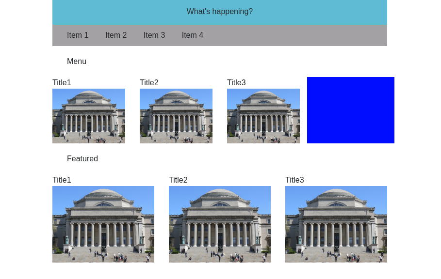
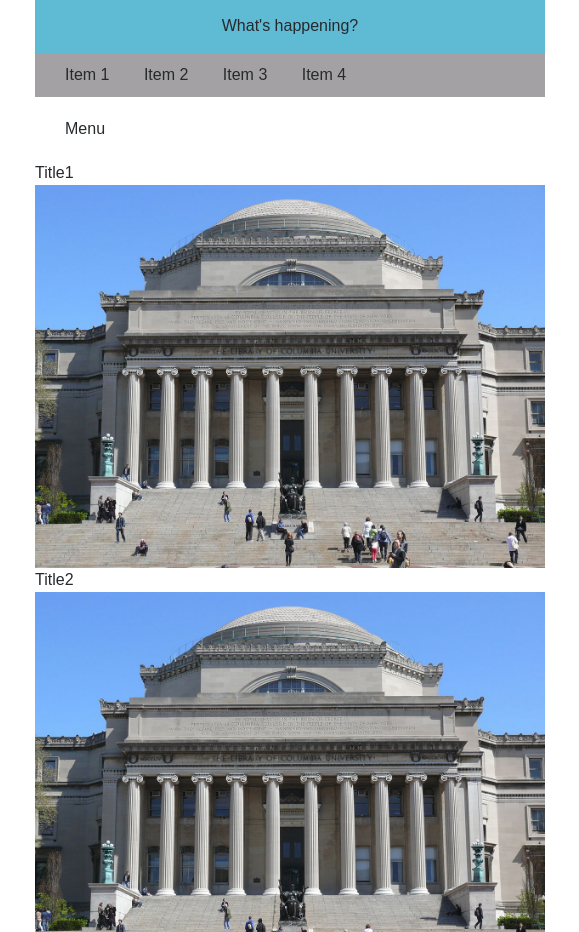
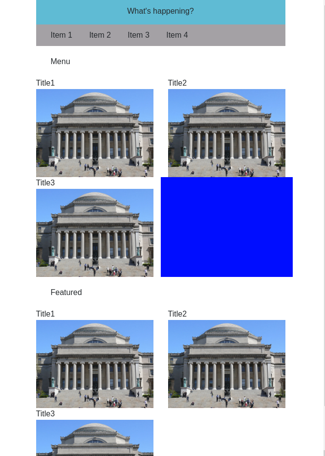

# Twitter Report

### a) Screenshot

### b) Images are always the right size -- How
* I used the Twitter bootstrap dynamic sizing columns to keep all the images the right size. I used `col-md-3` and `col-md-4`

### c) The blue square is taller than the rest -- how?
* I set the img to take up 100% of the parent element. In the tiles without the
  blue I inserted a row for the title. The blue box doesn't include row for the title.

### d) When the site is 500px wide what happens?
* 
* The site sits the images 1 on top of the other when the screen is 500px wide. You can put the images 2 to a row if you wany. I did this by adding the col-6 class.
  Screenshot below.
* 
