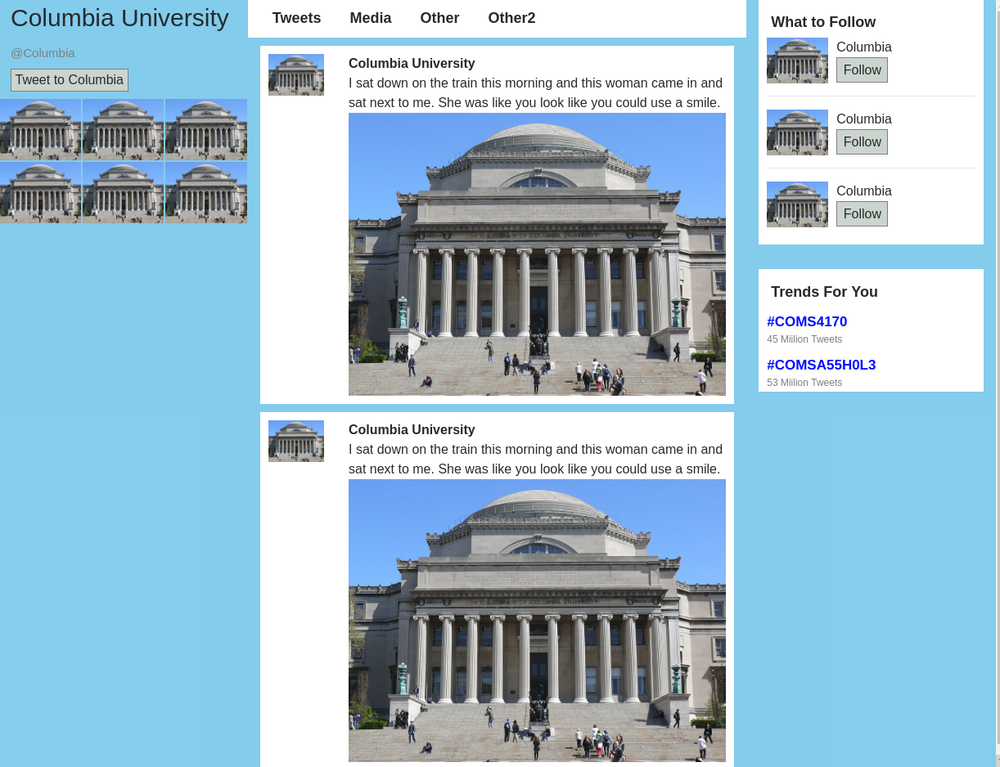

# Twitter account

### a) How did you color the background blue
* I set the background-color of the body to blue

### b) For the right column how did you get the image next to the text and button?
* I used a flex box to create my own row and column classes. Then I put the image in a column, and the text in a different column

### c) How did you get the text not to be centered?
* It didn't center for my by default. One could use the `float: left` to keep the text to the left.

### d) Container fluid
* Making container fluid removes the padding from the sides
* Screen shot

### e) what 3 tools to highlight the links?
* color
* size
* contrast

### f) How to separate the posts
* I set the margin on the post object
