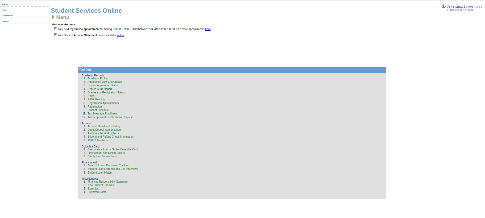

# Gestault Examples

### a) Example of Similarity

* The valentine day deals are grouped together in circles while the others are left as squares

### b) Example of enclosure

* The Data is brouped together in a grey enclosure that keeps the list together

### c) Example of Symmetry

* This image could be a list of city:time, but there is a clock in the middle for aesthetic appeal. The symmetry of the labels on each side of the clocks maintain a left right relationship rather than reading this information in columns. 
