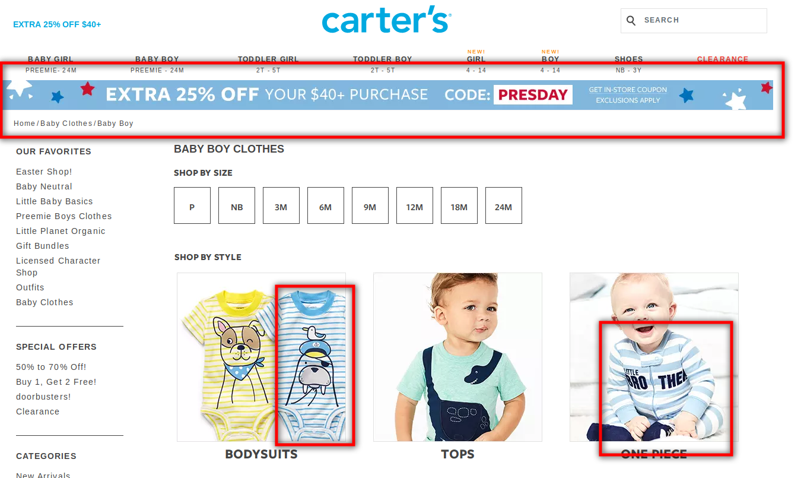
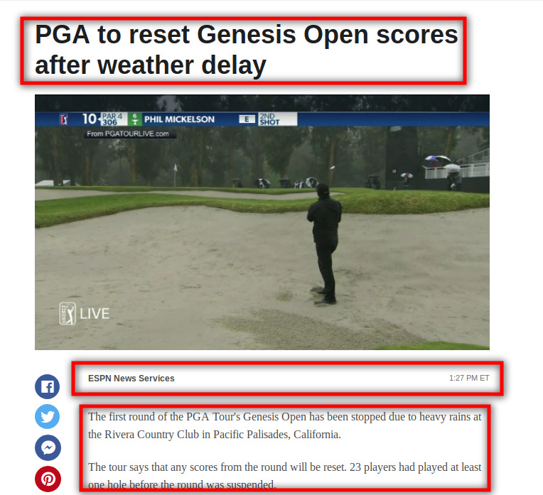
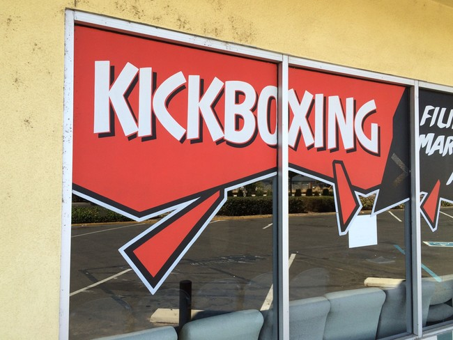

# Color and Font Writeup
---

### 1 Color usage

#### a) Show a screenshot where color is being used in a cultural context

#### b) What is the color, cultural context, and intended meaning?
The color is blue. In the united states blue is often associated with masculinity. Blue on this page is used to suggest that this clothing is for boys

#### c) How might another culture view this color?
According to the slides blue is associated with villainy in Japan. That would create a very different connotation for this page.

### 2 Good Font Usage

#### a) screenshot of good font

#### b) Typography terms and words used to describe the Fonts
I see 3 different fonts used on this page. The title weight is bolded with a greater point size so it sticks out to the user. And the article content is differentiated from the article metadata like title and the provider/time using serifs.

### 3 Bad Font Choice

#### a) Screenshot

#### b) Why the font is a bad choice.
Supposed to say kickboxing...instead it looks like kkkboxing.

#### c) Based on the Message what font could they have used instead?

#### d) Why is this a better choice?
* The normal weight of the font makes it readable and doesn't combine the i and the c
* By not using capital letters the ascenders in the i's and the descender in the g at the end of the word make it far easier to read
