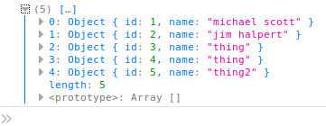

# HW 6 Report Problem 1

---

### 1) How many webpages does this server serve?

I think it serves 4 pages but only 3 of them are meant for viewing

* index page at /


* people at /people


* hello_name at /hello/<name>


* Not accessible add name page add /add_name


### 2) In hello.html what syntax makes the name show up in the html?
The mustache syntax: `<b>Hello {{name}}!</b>`

### 3) In people.html which lines imports people.js?
`  <script type="text/javascript" src="{{ url_for('static', filename = 'people.js') }}"></script>`
#### a) This line has two variables in it. What are they? What do they represent?
* The two variables are 'static' and filename=
* Static stands for the enpoint. In this case that is the static folder. The filename is the file in that endpoint that's being linked that's people.js. Together they form the file path.

### 4) In people.html which lines get the data sent from the server, put it into Javascript and parses the string into JSON?
`  var data = {{data|tojson}} `

### 5) In people.js what function contains the ajax call?
`saveName` makes the ajax call

### 6) What route does that function send data to?
`/add_name`

### 7) What data does it send?
It sends the name that is passed in as a parameter using JSON

### 8) If everything goes right on the server side what line(s) of code will execute on the front end?
```
function(result){
    var all_data = result["data"]
    data = all_data
    displayNames(data)
},
```

### 9) If something goes wrong on the server side what lines of code execute?
```
function(request, status, error){
    console.log("Error");
    console.log(request)
    console.log(status)
    console.log(error)
}
```

### 10) On the server what does add_name function do?
add_name parses the json and pulls out the name. Creates a name_entry object using the global id variable.
Adds that object to the global data variable and sends the whole data list back to the client using json.

### 11) If all goes well what does the add_name function return?


### 12) If you refresh the page will the changes remain?
Yes the changes stay because they are stored in the global python variable on the server.

### 13) If you restart the server will the changes you made still be there?
No the changes won't be there because the memory the global variable they were stored in will have been wiped out and re allocated fresh.
